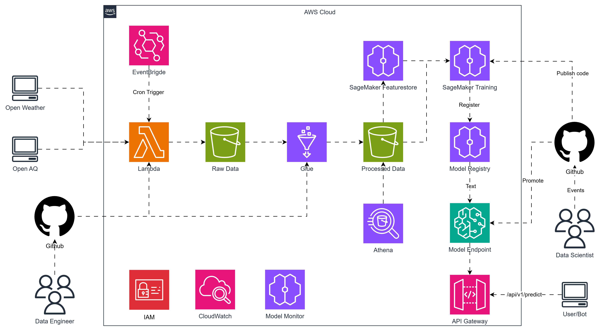

# Introduction

End-to-end ML service for Air Quality forecasting

## 🧠 Motivation and Research Relevance

Air pollution remains one of the most pressing environmental challenges of the 21st century, contributing to millions of premature deaths each year and significant economic losses worldwide. Traditional air quality monitoring systems often rely on hourly or daily measurements, which are insufficient for timely public response or dynamic policy intervention. The ability to forecast near-term air quality — such as predicting particulate matter (PM2.5) concentrations 30 minutes in advance — can empower individuals, urban planners, and environmental agencies to take proactive actions to reduce exposure and optimize city operations.

This project presents an **end-to-end machine learning pipeline on AWS** for short-term **Air Quality Index (AQI) forecasting**. By integrating **real-time open data sources** (OpenAQ and OpenWeather), the system continuously ingests, cleans, and transforms environmental data through a robust **ETL pipeline** built with **AWS Lambda**, **Glue**, and **S3**. The processed data feed a **15-minute-resolution forecasting model** powered by **XGBoost**, trained and deployed via **Amazon SageMaker**. Predictions are served through an automated **CI/CD workflow** implemented with **GitHub Actions** and monitored using **AWS CloudWatch** for performance, drift, and operational health.

From a research and engineering standpoint, this work demonstrates:

- ⚙️ **Scalable data infrastructure** using serverless and managed AWS services for continuous, low-latency environmental data ingestion and processing.  
- 📈 **Applied time-series forecasting** with engineered lag, rolling, and weather features for near-term PM2.5 prediction.  
- 🧩 **Reproducible MLOps practices**, ensuring the entire pipeline — from data to model to deployment — is versioned, testable, and observable.  

Beyond its technical contribution, the project highlights the potential of machine learning in **environmental intelligence** and **sustainable urban management**, bridging the gap between academic research and deployable data-driven systems. It reflects the growing importance of **responsible AI for social good**, combining open data, cloud computing, and predictive modeling to deliver actionable insights for cleaner air and healthier communities.

## Quick start

```bash
python -m pip install -e .
python scripts/train.py --config scripts/local_example.yaml
python scripts/evaluate.py --config scripts/local_example.yaml
python scripts/package_model.py --artifacts out/model --output out/model.tar.gz
```
# High Level Architecture 


